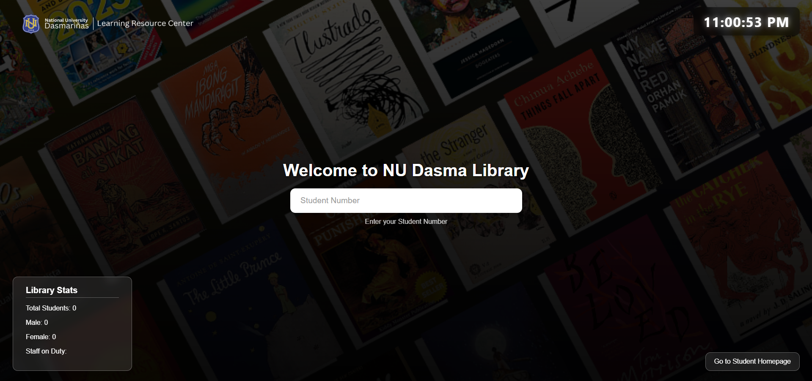
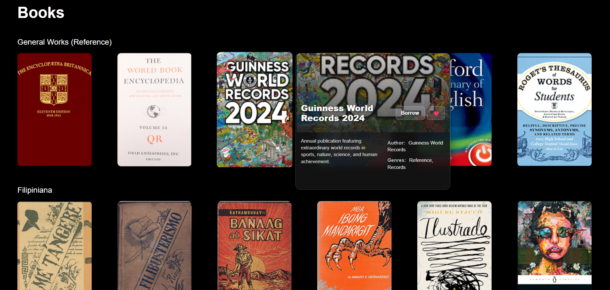
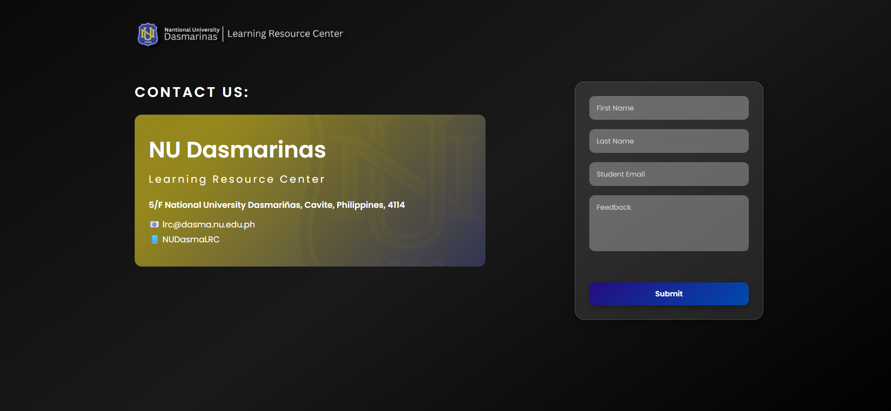

# 📜 NU Library Management System

This project is a web-based Library Management System developed as part of our Web Development project. The system is designed to simplify and automate the management of library operations such as student monitoring, borrowing books, and user management.   

   
   
  

📁 Built using HTML, CSS, and JavaScript.  

Live at: https://jveztraaaa.github.io/library-management-system/
  

🚧 Work on Progress: This project is still under development. Features such as search functionality, database integration, and user roles (e.g., admin vs. student) are still being developed.