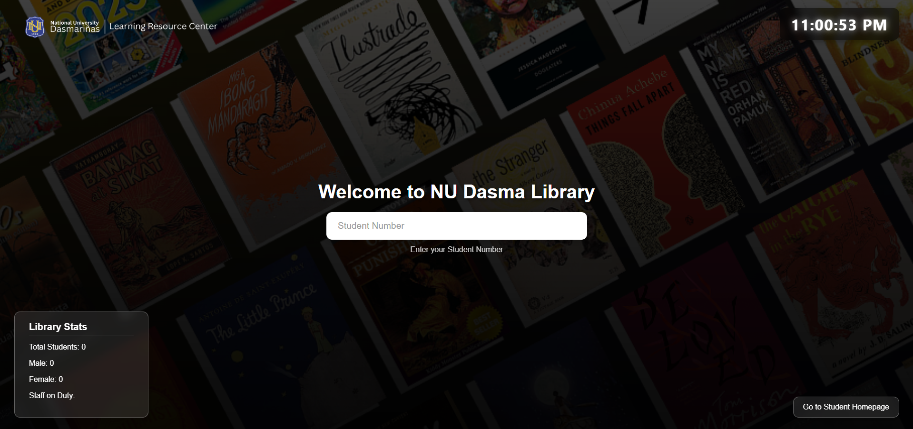
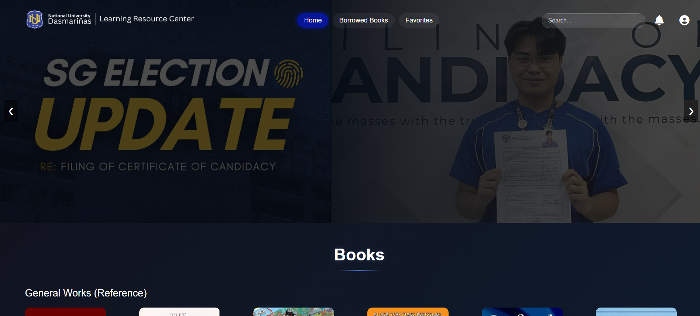
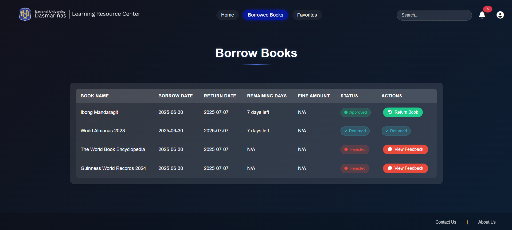
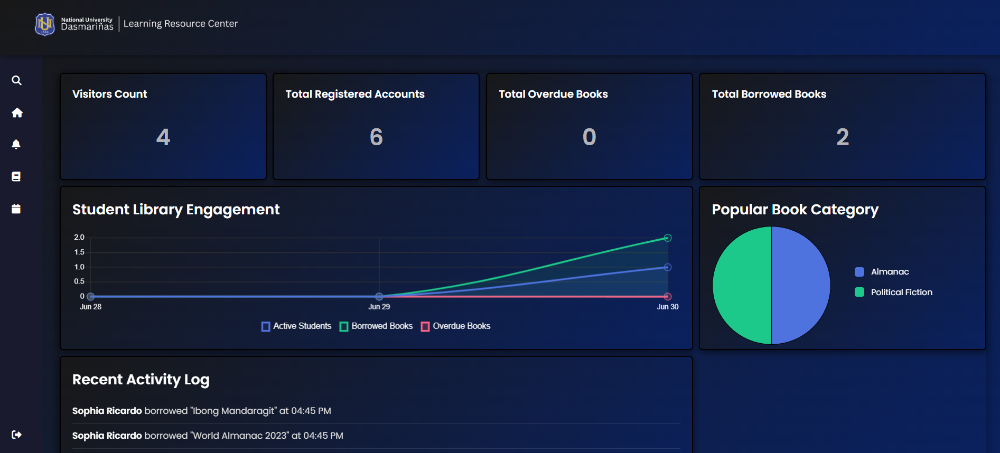
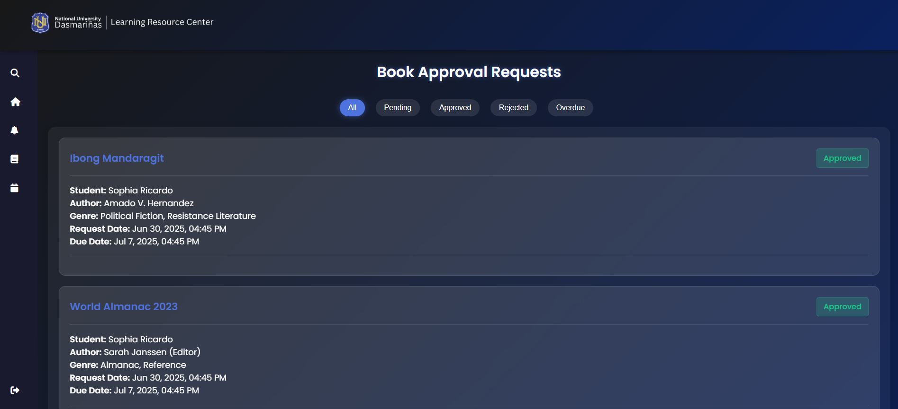
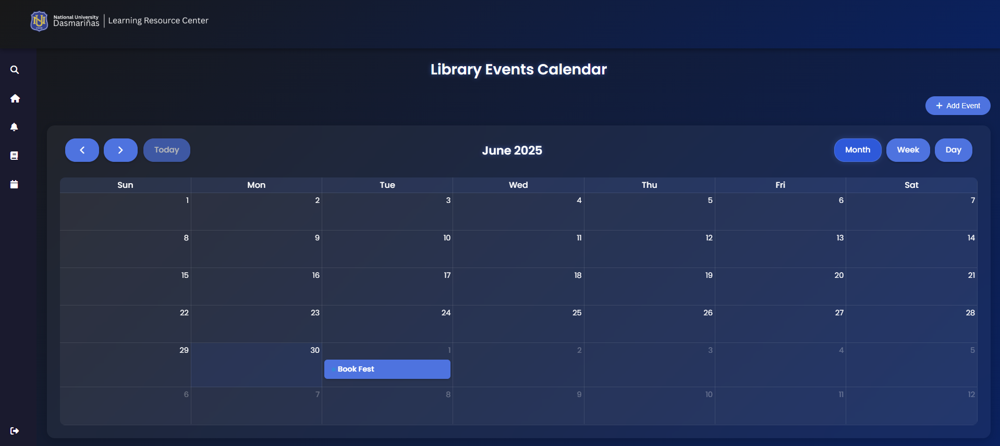

# 📜 NU Library Management System

This project is a web-based Library Management System developed as part of our Web Development project. The system is designed to simplify and automate the management of library operations such as student monitoring, borrowing books, and user management. <br><br>

## 💻 User Preview
 <br><br>
 <br><br>
 <br><br>
 <br><br>

## ⚙️ Admin Preview
 <br><br>
 <br><br>
 <br><br>

## 🚀 Installation Steps
Follow these steps to set up the project on your local machine:

1. **Install XAMPP**  
   Download and install [XAMPP], if you haven’t already.

2. **Clone the Repository**  
   Open your terminal or command prompt and navigate to the `htdocs` directory inside your XAMPP installation folder:
   ```bash
   cd C:\xampp\htdocs
   git clone https://github.com/JvEztraaaa/library-management-system.git
   ```

3. **Start Apache and MySQL**  
   Open the XAMPP Control Panel and start both **Apache** and **MySQL**.

4. **Import the Database**  
   - Open your browser and go to [http://localhost/phpmyadmin](http://localhost/phpmyadmin)  
   - Create a new database named `library`  
   - Click the `Import` tab  
   - Upload the SQL file located at:  
     ```
     library-management-system/database/library.sql
     ```
   - Click **Go** to import the database.

5. **Access the System**  
   Open your browser and go to:  
   [http://localhost/library-management-system](http://localhost/library-management-system)

📁 Built using HTML, CSS, and JavaScript. <br>

🗓️ Completed: June 2025